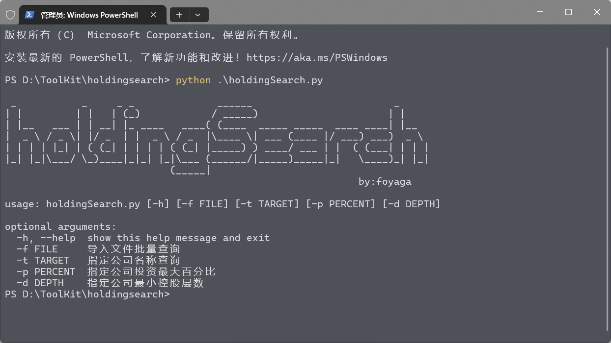

<h1 align="center">holdingSearch</h1>
<h3 align="center">子公司控股企业查询</h3>


# 使用方法

```bash
python .\holdingSearch.py

 _           _     _ _              ______                        _     
| |         | |   | (_)            / _____)                      | |    
| |__   ___ | | __| |_ ____   ____( (____  _____ _____  ____ ____| |__  
|  _ \ / _ \| |/ _  | |  _ \ / _  |\____ \| ___ (____ |/ ___) ___)  _ \ 
| | | | |_| | ( (_| | | | | ( (_| |_____) ) ____/ ___ | |  ( (___| | | |
|_| |_|\___/ \_)____|_|_| |_|\___ (______/|_____)_____|_|   \____)_| |_|
                            (_____|                                     
                                                            by:foyaga
        
usage: holdingSearch.py [-h] [-f FILE] [-t TARGET] [-p PERCENT]      
                        [-d DEPTH]

optional arguments:
  -h, --help  show this help message and exit
  -f FILE     导入文件批量查询
  -t TARGET   指定公司名称查询
  -p PERCENT  指定公司投资最大百分比
  -d DEPTH    指定公司最小控股层数
```

1. 首先爱企查账号必须有爱企查会员权限。

2. 把爱企查的 cookie 复制到 cookie.config 文件中。

3. 参数-t单个查询，-f导入文件批量查询 

4. 查询结果会自动保存在 excel 文档中。

5. 如果提示百度安全验证，则可能是 cookie 失效或者需要手动去爱企查网页进行图形验证码验证。

# 说明

部分代码参考自：[wgpsec/ENScan](https://github.com/wgpsec/ENScan)，修改自 [foyaga/holdingSearch](https://github.com/foyaga/holdingSearch)。

# 免责申明

由于传播、利用开源信息而造成的任何直接或间接的后果及损失，均由使用者本人负责，作者不承担任何责任。 开源仅作为安全研究之用！切勿用作实战用途！