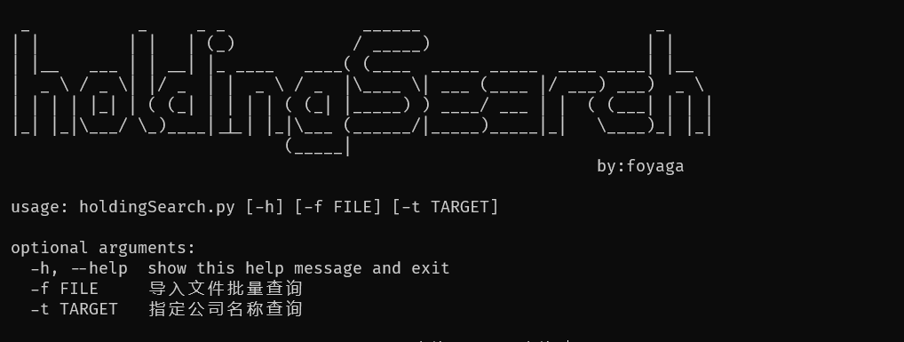

# 说明
**功能**：获取对应公司在爱企查平台上的50%及以上控股企业名称数据。

部分代码参考自：ENScan（https://github.com/wgpsec/ENScan）
# 使用方法
1、首先爱企查账号必须有爱企查会员权限。

2、把爱企查的cookie复制到cookie.config文件中。

3、参数-t单个查询，-f导入文件批量查询

4、查询结果会自动保存在excel文档中。

5、如果提示百度安全验证，则可能是cookie失效或者需要手动去爱企查网页进行图形验证码验证。
# 免责申明
由于传播、利用开源信息而造成的任何直接或间接的后果及损失，均由使用者本人负责，作者不承担任何责任。 开源仅作为安全研究之用！切勿用作实战用途！